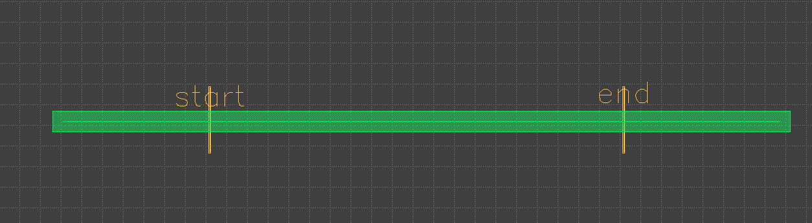
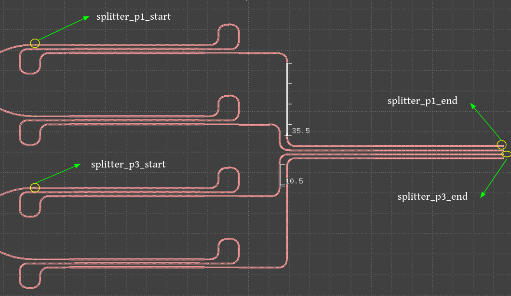

Path Length Analysis
====================

[](/LICENSE)  [](https://github.com/mabrains/) [](https://github.com/mabrains) [](https://github.com/mabrains)

<!-- [](https://github.com/mabrains/path_length_analysis/actions/workflows/pypi-packages.yml) -->

[<p align="center">](http://mabrains.com/)


# Table of contents
- [Path Length Analysis](#path-length-analysis)
- [Table of contents](#table-of-contents)
  - [Introduction](#introduction)
  - [Current-Status](#current-status)
  - [Folder Structure](#folder-structure)
  - [Prerequisites](#prerequisites)
  - [Installation](#installation)
  - [Usage](#usage)
    - [Example](#example)
  - [About Mabrains](#about-mabrains)
  - [Contact-Us](#contact-us)
  - [License](#license)


## Introduction

Measuring and optimizing path lengths in resistive paths for integrated circuits and photonic paths are fundamental aspects of design and layout optimization. It directly influences signal integrity, performance, propagation delay, power efficiency, phase matching, and the overall functionality of electronic and photonic systems.

## Current-Status

> :warning: We are currently treating the current content as an **experimental preview!**

The tool will be tagged with a production version when ready to do.

## Folder Structure
```
📁 path_length_analysis
 ┣ 📁path_analysis              Includes path_length tool script.
 ┣ 📁images                     Contains images used for illustration.
 ┣ 📁.github                    Includes CI workflows for github actions.
 ┣ 📜Makefile                   To make some tests for path_length_analysis tool.
 ┣ 📜requirements.txt           List of python packages required for tool installation.
 ┣ 📜requirements.test.txt      List of python packages required for testing purpose.
 ┣ 📜path_length.py             Python script to calculate path length for a gds file. 
 ┣ 📜setup.py                   Python script used for package setup. 
 ┣ 📜.flake8                    Includes flake8 configuration setup.
 ┣ 📜.gitignore                 Excludes certain local files from being pushed to Git.
 ┗ 📜README.md                  This file that describes the contents.

```

## Prerequisites

At a minimum:

- python 3.9+
- python3-venv

To install a virtual environment for ubuntu 22.04:

```bash
python3 -m pip install --user virtualenv
# OR
sudo apt-get install -y python3-venv
```

## Installation

To install the path length tool from source, you could run the following commands:

```bash
git clone https://github.com/mabrains/path_length_analysis.git
cd path_length_analysis/

python3 -m venv ./env
source ./env/bin/activate

python3 setup.py install
```

## Usage

This tool calculates the path length based on the presence of the cutting shape on the path you need to measure it accompanied by a text that refers to the cutting name, you could consider it as a port on the path you have.

As shown in the following figure, we could measure the path length between the `start` & `end` ports.

<p align="center">
  
</p>
<p align="center">
  Fig. 1. Path length sample for illustration
</p>

> **_NOTE:_** The text should be inside the cutting shape, the cutting shape and its text are on the same layer,

Before running the python script that measure the path length for layout routes, you have to complete some configurations in [config.yaml](./path_analysis/config.yaml) file, and they all are declared in the table below:

|Parameter    | Description                                                                      | Selection |
|:-----------:|:--------------------------------------------------------------------------------:| --------- |
|gds_file     | Path of layout file you need to measure its paths                                | Required  | 
|cell_name    | Name of top cell in your layout if you have more one cell                        | Optional  |
|path_layer   | Tuple of two integers for path layer number and data type                        | Required  |
|cutting_layer| Tuple of two integers for cutting layer number and data type                     | Required  |
|nodes        | Ports of interest to be filtered, corresponds to text placed on cutting polygons | Optional  |

</br>

The [path_length.py](./path_analysis/path_length.py) script takes your config file to run path length analysis on it and save run logs and results.

You could find the run results at your run directory if you previously specified it through `--run_dir=<run_dir_path>`, default path of run directory is `length_run_<date>_<time>` in current directory.

```bash
  python3 path_length.py (--help| -h)
  python3 path_length.py (--config=<config_file_path>) [--run_dir=<run_dir_path>]
```

**Options**

- `--help -h`                        Print this help message.
- `--config=<config_file_path>`      Yaml file contains the path length parameters.
- `--run_dir=<run_dir_path>`         Run directory to save all the results [default: pwd].

</br>

### Example

```bash
  python3 path_length.py --config=tests/lidar_no_rad.yaml --run_dir=lidar_no_rad_results
```

**Input-Config**

```yaml
gds_file: tests/lidar_no_rad.gds
cell_name: lidar
path_layer: 
  layer_no: 1
  layer_dtype: 0
cutting_layer:
  layer_no: 1
  layer_dtype: 10
nodes: 
- splitter_p1_start
- splitter_p1_end
- splitter_p2_start
- splitter_p2_end
```

**Input-Test** 

<p align="center">
  
</p>
<p align="center">
  Fig. 2. Path length example for lidar layout
</p>

**Output-Result** 
|port1           |port2          |length (um)      |
|:--------------:|---------------|-----------------|
splitter_p1_start|splitter_p1_end|526.1392525630397|
splitter_p3_start|splitter_p3_end|501.1340271504263|

We could notice that both paths are identical except for the vertical distance shown in the previous figure. 

```
** diff_vertical_part = 35.5 - 10.5 = 25um
** diff_total_length = 526.1 - 501.1 = 25um
```

## About Mabrains

Mabrains was founded to achieve the main purpose to change the world of Chip Design using AI. Empowering the world with a new methodologies and techniques that would disrupt the status quo in the EDA industry.

We have contributed in developing many PDKs for Open Source Tools. For more information, please refer to [Mabrains-Github](https://github.com/mabrains).

## Contact-Us

Requests for more information about Path Length tool and other open source technologies can be [submitted via this web form](https://mabrains.com/#contactus).

## License

The Path Length tool is released under the [GNU Lesser General Public License - Version 3](/LICENSE)

The copyright details (which should also be found at the top of every file) are;

```
# SPDX-FileCopyrightText: 2024 Mabrains Company
# Licensed under the GNU Lesser General Public License, Version 3.0 (the "License");
# you may not use this file except in compliance with the License.

#                    GNU Lesser General Public License
#                       Version 3, 29 June 2007

# This program is free software: you can redistribute it and/or modify
# it under the terms of the GNU Lesser General Public License as published
# by the Free Software Foundation, either version 3 of the License, or
# (at your option) any later version.
#
# This program is distributed in the hope that it will be useful,
# but WITHOUT ANY WARRANTY; without even the implied warranty of
# MERCHANTABILITY or FITNESS FOR A PARTICULAR PURPOSE.  See the
# GNU Lesser General Public License for more details.
#
# You should have received a copy of the GNU Lesser General Public License
# along with this program.  If not, see <https://www.gnu.org/licenses/>.
# SPDX-License-Identifier: LGPL-3.0
```
